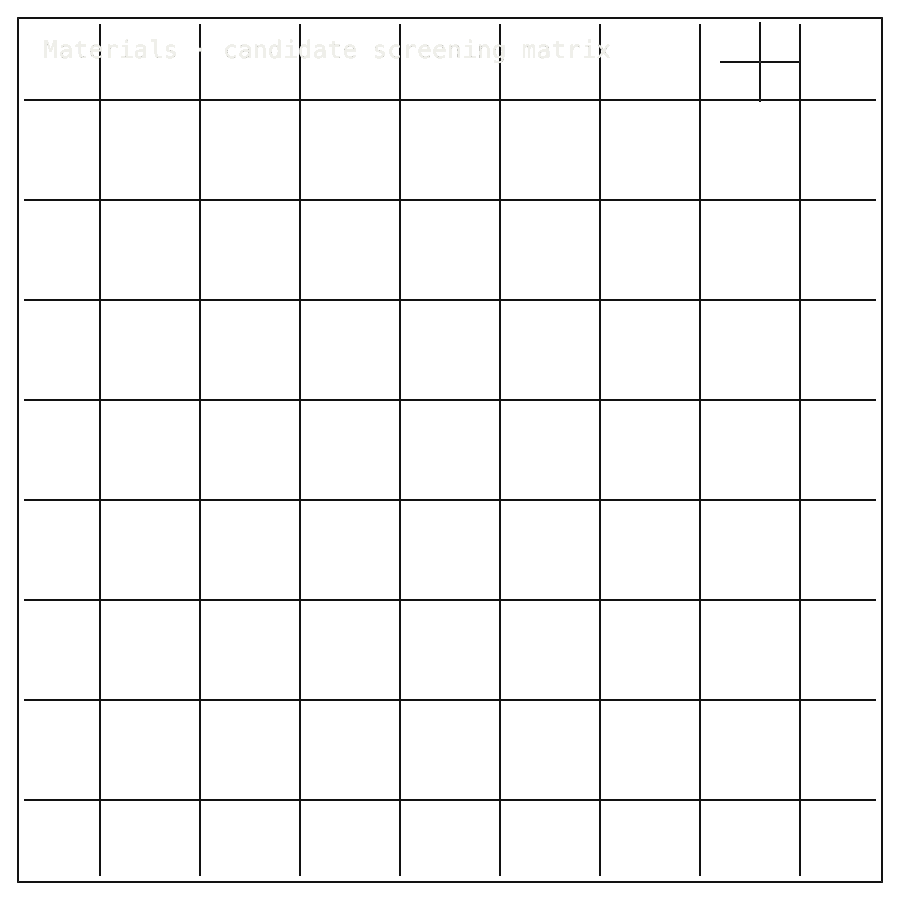

# Materials-Workbench

## Package Install

Installable package: `python3.11 -m pip install zer0pa-materials-workbench`.
Current release: `0.1.0` on [PyPI](https://pypi.org/project/zer0pa-materials-workbench/).
Source: [Zer0pa/Materials-Workbench](https://github.com/Zer0pa/Materials-Workbench/).

```bash
python3.11 -m pip install zer0pa-materials-workbench
```

For full install, smoke, source, and developer commands, [click here](#install-developer-commands-detailed).

---

<table width="100%">
<tr>
<td width="100%" valign="top">
<div><span><b>00 · MATERIALS</b> · INSILICO WORKBENCH</span> <span>RESEARCH-READY · H100 ARTIFACT OPEN</span></div>
      <h1>Innovating Materials With <span>Computational Periodic Tables</span></h1>
      <p>Materials lane &middot; Materials-Workbench &middot; PyPI <code>zer0pa-materials-workbench</code> v0.1.0 stale &middot; github.com/Zer0pa/Materials-Workbench</p>
      <p>Materials Workbench is a CPU-side bench for in-silico battery and thermoelectric research. Candidate chains arrive with schemas, validators, recompute checks, and dispatch wired together, so weak chemistries are rejected at the desk before they consume cluster hours. <strong>3,547 strict-full tests pass and 588 Runpod-sim parity tests hold;</strong> the H100 campaign is the next wave, <em>not the current result</em>. Real GPU evidence is not claimed yet.</p>
</td>
</tr>
</table>

<table width="100%">
<tr>
<td width="100%" valign="top">
<figure>
        <div></div>
        <figcaption><b>Scope:</b> CPU-side materials workbench. Schemas, validators, recompute, and Runpod-sim parity pass; real H100 evidence is next.</figcaption>
      </figure>
</td>
</tr>
</table>

<table width="100%">
<tr>
<td width="100%" valign="top">
<div><b>01 · THE GAP</b> <span>SPLIT WORKFLOWS</span></div>
      <h2>&ldquo;Most candidate chemistries reach the cluster before anyone has really vetted them.&rdquo;</h2>
</td>
</tr>
</table>

<table width="100%">
<tr>
<td width="100%" valign="top">
<div><b>02 · MARKETS</b> <span>WORKFLOW FIT</span></div>
      <div>
        <div>
          <div><span>Battery R&amp;D groups</span>  <span>fit</span></div>
          <div><span>Materials informatics teams</span>  <span>primary</span></div>
          <div><span>Thermoelectric R&amp;D groups</span>  <span>fit</span></div>
          <div><span>Industrial AI / MLIP teams</span>  <span>fit</span></div>
          <div><span>DFT / solver groups</span>  <span>adjacent</span></div>
        </div>
      </div>
      <div>Workflow-fit hypotheses for a CPU pre-screen bench; not adoption, not TAM, not a discovery claim.</div>
</td>
</tr>
</table>

<table width="100%">
<tr>
<td width="50%" valign="top">
<div><b>03 · VALUE OF MARKET</b></div>
      <div><span>CPU-side</span> <span>bench</span></div>
      <div>Best fit: materials informatics, battery, thermoelectric, and industrial AI teams that need pre-HPC candidate checks.</div>
</td>
<td width="50%" valign="top">
<div><b>04 · INSIGHT</b></div>
      <h2>Reject weak materials chains before any GPU <span>runs them.</span></h2>
</td>
</tr>
</table>

<table width="100%">
<tr>
<td width="50%" valign="top">
<div><b>05.0 · CURRENT TECH</b> <span>SPECIALIZED SOLVERS, SPLIT HANDOFF</span></div>
        <p>Today's stack threads DFT, phonons, MLIP, CALPHAD, phase-field, provenance, and lab automation through separate specialised tools. The gap is not a missing solver. It is a shared candidate record that lives before H100 spend.</p>
</td>
<td width="50%" valign="top">
<div><b>05.1 · OUR TECH</b> <span>RAW-EVIDENCE RECOMPUTE</span></div>
        <p>Materials Workbench at Zer0pa/Materials-Workbench is an installable alpha that holds <strong>schemas, validators, seven recompute checks, packet records, Runpod dispatch, and an H100 cutover path</strong> in one CPU-side bench. Battery and thermoelectric candidates run the same pre-screen on a laptop today that they will run against <strong>real GPU artifacts</strong> in the H100 wave.</p>
</td>
</tr>
</table>

<table width="100%">
<tr>
<td width="100%" valign="top">
<div><b>05.2 · BENCHMARKS</b> <span>POST-WAVE-F &middot; CPU + RUNPOD-SIM</span></div>
      <div>
        <div>
          <div><span>Tests</span><b>3,547</b><small>strict-full PASS</small></div>
          <div><span>Parity</span><b>588</b><small>Runpod parity tests</small></div>
          <div><span>Recompute</span><b>7</b><small>raw-evidence checks</small></div>
          <div><span>Stress cases</span><b>16</b><small>plus 7 checks</small></div>
        </div>
        <div>
          <div><span>CPU strict</span>  <span>3,547/3,547</span></div>
          <div><span>Runpod parity</span>  <span>588/588</span></div>
          <div><span>H100 evidence</span>  <span>pending</span></div>
        </div>
      </div>
      <div><b>Current status:</b> 16/16 stress cases caught &middot; 7 recompute checks hardened &middot; <em>no real GPU-backed runpod_rest artifact yet</em>.</div>
</td>
</tr>
</table>

<table width="100%">
<tr>
<td width="34%" valign="top">
<div><b>06 · MEASUREMENT</b> <span>RECOMPUTE + HASH HISTORY</span></div>
      <h2>7 recompute checks, 16 stress cases, hash history over <span>every chain.</span></h2>
</td>
<td width="66%" valign="top">
<div><b>06.1 · COMPARATIVE PERFORMANCE &middot; CPU WORKBENCH VS GPU CAMPAIGN</b></div>
      <div>
        <div>
          <div><span>CPU strict-full</span>  <span>3,547 / 3,547 PASS</span></div>
          <div><span>Runpod parity</span>  <span>588 / 588 PASS</span></div>
          <div><span>H100 real artifact</span>  <span>campaign pending</span></div>
          <div><span>DFT/MLIP comparator</span>  <span>not yet measured</span></div>
        </div>
      </div>
      <div>CPU strict-full and Runpod-sim parity hold today. <b>H100 is the next campaign &mdash; no real GPU result has been produced yet.</b> DFT/MLIP comparator parity sits outside the CPU bench.</div>
</td>
</tr>
</table>

<table width="100%">
<tr>
<td width="100%" valign="top">
<div><b>07 · KEY METRICS</b> <span>MATERIALS-WORKBENCH POST-WAVE-F</span></div>
</td>
</tr>
</table>

<table width="100%">
<tr>
<td width="100%" valign="top">
<div><b>07.1 · CPU STRICT CHECK</b></div>
      <div>3,547<span>/3,547</span></div>
      <div>Strict-full pass &middot; <b>2 pycalphad skips, 0 misses</b></div>
</td>
</tr>
</table>

<table width="100%">
<tr>
<td width="100%" valign="top">
<div><b>07.2 · RUNPOD PARITY</b></div>
      <div>588<span>PASS</span></div>
      <div>Runpod parity tests &middot; <b>mock results blocked from posing as real</b></div>
</td>
</tr>
</table>

<table width="100%">
<tr>
<td width="100%" valign="top">
<div><b>07.3 · RECOMPUTE CHECKS</b></div>
      <div>7<span>hardened</span></div>
      <div>Raw-evidence recompute &middot; <b>inputs, sources, novelty, ionic, NEB stages</b></div>
</td>
</tr>
</table>

<table width="100%">
<tr>
<td width="100%" valign="top">
<div><b>07.4 · STRESS CASES</b></div>
      <div>16<span>/16</span></div>
      <div>Replay-error breaches plus recompute checks &middot; <b>0 misses</b></div>
</td>
</tr>
</table>

<table width="100%">
<tr>
<td width="100%" valign="top">
<div><b>07.5 · GPU EVIDENCE</b></div>
      <div>null</div>
      <div>Metric pending &middot; <b>no real GPU result produced yet</b></div>
</td>
</tr>
</table>

<table width="100%">
<tr>
<td width="100%" valign="top">
<div><b>08 · DETERMINISM</b> <span>RECOMPUTE BEFORE GPU</span></div>
      <h2>Every chain replays on CPU before any GPU <span>touches it.</span></h2>
</td>
</tr>
</table>

<table width="100%">
<tr>
<td width="66%" valign="top">
<div><b>08.1 · WHAT DETERMINISTIC MEANS</b> <span>RAW-EVIDENCE RECOMPUTE</span></div>
      <p>The seven recompute checks take a candidate chain's outputs and <strong>re-derive every layer's hash from inputs</strong>. Any divergence rejects the chain; only chains that survive the recompute move forward.</p>
      <p>The discipline runs today on CPU and on the Runpod-sim parity surface (<strong>3,547 strict-full + 588 parity</strong>). The H100 wave will run the same checks against real GPU artifacts. The unit of bit-exactness is <em>per-chain, per-layer-hash</em>.</p>
</td>
<td width="34%" valign="top">
<div><b>08.2 · THE FIDELITY GAP</b></div>
      <span>Honest Blocker &middot;</span>
      <p><strong>No real GPU-backed <code>runpod_rest</code> artifact has been produced.</strong> Discovery of any material is not claimed. Public PyPI v0.1.0 is live but stale pending v0.1.1. <em>License is SAL-7.1 / GitHub NOASSERTION; UMA/HF org, Materials Project credential, real endpoints, and EMMO cleanup remain open.</em></p>
</td>
</tr>
</table>

<table width="100%">
<tr>
<td width="33%" valign="top">
<div><b>09</b> </div>
      <h2>FIVE PATHS FROM ONE <span>PRE-GPU BENCH.</span></h2>
</td>
<td width="67%" valign="top">
<div><b>09.1 · THIS REPO'S AMBITION</b></div>
      <p>The hinge is not one chemistry result. It is a bench where candidate generation, validators, constraints, and run history travel together from a researcher's laptop to a GPU cluster. If that path survives H100 completion, materials exploration becomes something other teams can repeat, compare, and contest.</p>
</td>
</tr>
</table>

<table width="100%">
<tr>
<td width="33%" valign="top">
<div><b>09.2 · WHAT WORKS NOW</b></div>
        <h2>Working now: candidate-bench architecture, validation route, CPU and Runpod-sim parity, H100 completion target.</h2>
</td>
<td width="67%" valign="top">
<div><b>09.3 · WHAT'S STILL OPEN</b></div>
        <h2>Still open: H100 execution, real GPU artifact, candidate data, release evidence, and source context.</h2>
</td>
</tr>
</table>

<table width="100%">
<tr>
<td width="100%" valign="top">
<div><b>09.4</b> &middot; LAB BUDGETS · NEAR-TERM (12&ndash;24 MO)</div>
      <div>Weak chemistries die at the desk</div><div>A battery research lead can spend a Monday morning killing forty candidate chains on a laptop instead of carrying them into a Friday cluster reservation. The H100 queue starts holding fewer candidates that nobody really believed in.</div>
</td>
</tr>
</table>

<table width="100%">
<tr>
<td width="100%" valign="top">
<div><b>09.5</b> &middot; INFORMATICS · NEAR-TERM (12&ndash;24 MO)</div>
      <div>Every search path carries its own paper trail</div><div>A materials-informatics team that ran a thermoelectric sweep last quarter can pull any candidate back up months later and see exactly which validator fired and which input drove it. The next investigator does not start from the team's slack scrollback.</div>
</td>
</tr>
</table>

<table width="100%">
<tr>
<td width="100%" valign="top">
<div><b>09.6</b> &middot; GPU ECONOMICS · MID-TERM (24&ndash;48 MO)</div>
      <div>H100 hours stop funding speculation</div><div>When the same recompute discipline survives onto real GPU runs, a lab director can justify H100 spend against a candidate's pre-screen record. The conversation with procurement moves from &ldquo;we need more cluster time&rdquo; to &ldquo;these forty chains earned it.&rdquo;</div>
</td>
</tr>
</table>

<table width="100%">
<tr>
<td width="100%" valign="top">
<div><b>09.7</b> &middot; COLLABORATION · MID-TERM (24&ndash;48 MO)</div>
      <div>One candidate, not eight notebooks</div><div>A battery candidate handed between two groups &mdash; a DFT specialist and a phase-field modeller &mdash; arrives as one object carrying schema, constraints, validator output, and run history. The receiving team can rerun and contest it without rebuilding the reasoning from emails.</div>
</td>
</tr>
</table>

<table width="100%">
<tr>
<td width="100%" valign="top">
<div><b>09.8</b> &middot; DISCOVERY DISCIPLINE · PARADIGM (48 MO+)</div>
      <div>Materials R&amp;D inherits release discipline</div><div>If candidate generation, validation, and execution stay coupled all the way through GPU scale, the center of gravity in materials discovery moves from a single hero result toward governed evidence flows that any independent group can pick up and continue.</div>
</td>
</tr>
</table>

---

<a id="install-developer-commands-detailed"></a>

## Install / Developer Commands Detailed

<!-- INSTALL-DX:START -->
#### Package Install

Installable package: `python3.11 -m pip install zer0pa-materials-workbench`.
Current release: `0.1.0` on [PyPI](https://pypi.org/project/zer0pa-materials-workbench/).
Source: [Zer0pa/Materials-Workbench](https://github.com/Zer0pa/Materials-Workbench/).

```bash
python3.11 -m pip install zer0pa-materials-workbench
```

Import smoke:

```bash
python3.11 - <<'PY'
import importlib.metadata as md
import zer0pa_materials_workbench

print("zer0pa-materials-workbench", md.version("zer0pa-materials-workbench"))
PY
```


CLI smoke:

```bash
zer0pa-materials-workbench --help
```

Install success only proves package acquisition/import. Product scope, stale PyPI state, platform limits, and blockers remain in the front-door sections below.
- PyPI copy is stale or pending refresh; install success is not product readiness.
<!-- INSTALL-DX:END -->
